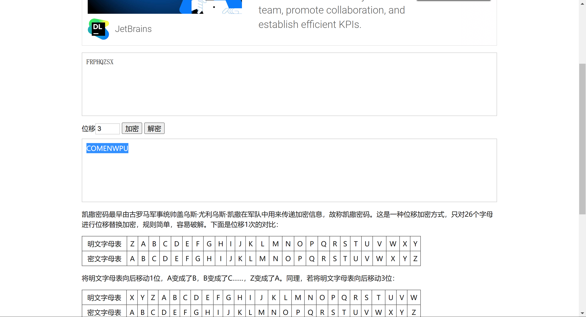
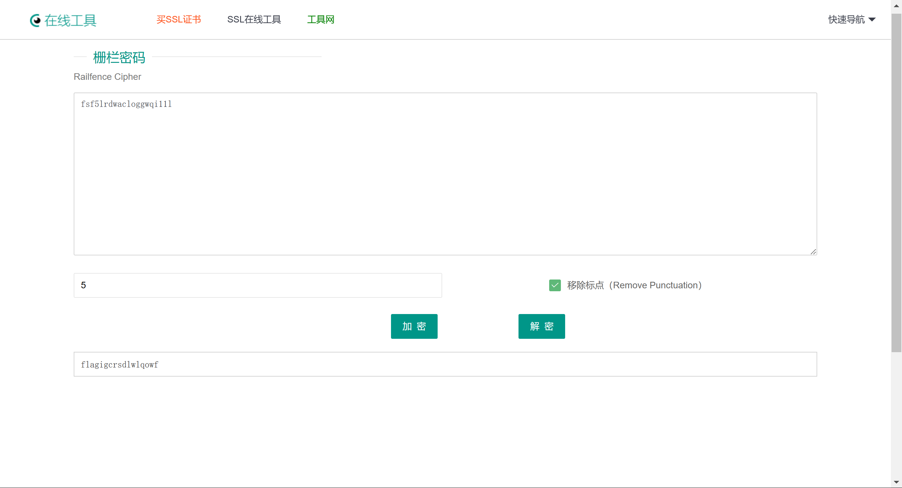
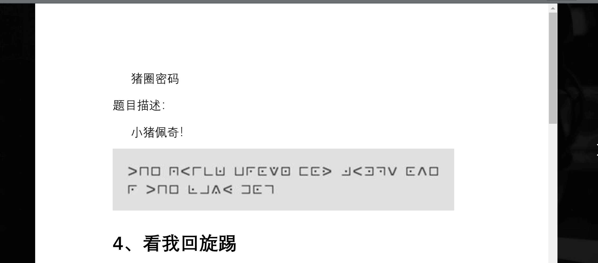
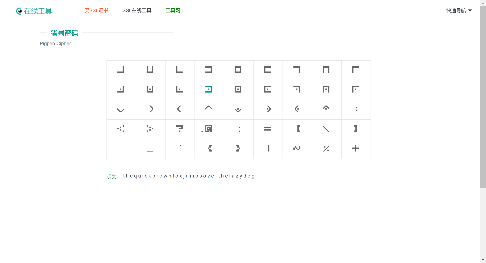
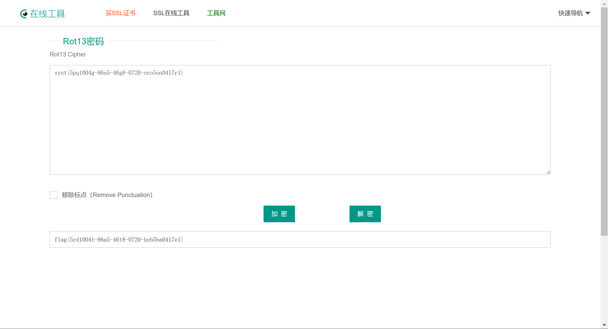
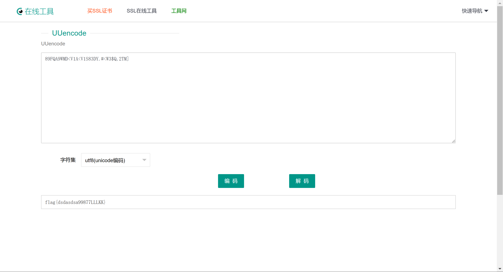
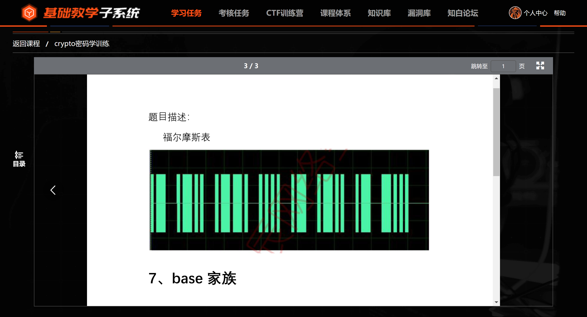
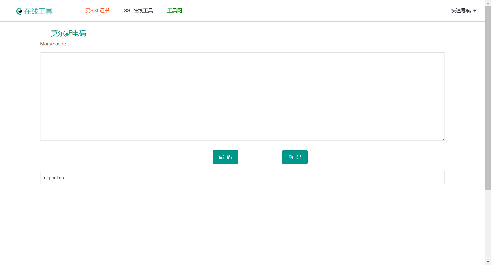
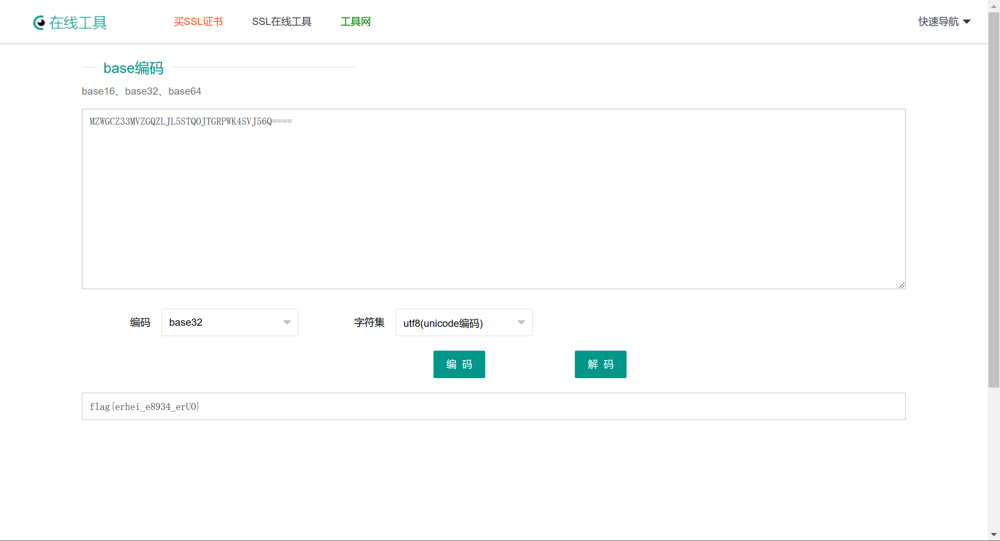

# 实验1-8实验报告

## 实验一

### 实验目的

``` blank
题目名称:
大帝的密码武器题目描述
公元前一百年，在罗马出生了一位对世界影响巨大的人物，他生前是罗马三巨头之一。他率先使用了一种简单的加密函，因此这种加密方法以他的名字命名
加密后: FRPHQZSX
明文?
```

### 实验过程

``` blank
分析题目，由常用密码得知凯撒密码即为题目所求，因此直接解密即可。
```

```blank
凯撒密码是最早的代换密码，使用单表代换。其基本思想是：通过把字母移动一定的位数来实现加密和解密。明文中的所有字母都在字母表上向后(或向前)按照一个固定数目进行偏移后被替换成密文。例如，当偏移量是3的时候，所有的字母A将被替换成D，B变成E，以此类推X将变成A，Y变成B，Z变成C。位数就是凯撒密码加密和解密的密钥。在本题中，使用的位移为3位，能够得到有意义的明文。本题明文为:
COMENWPU。
``` 



---

## 实验二

### 实验目的

``` blank
题目名称
木册木兰，题目字数分组
题目描述
fsf5lrdwacloggwqi11l
```

### 实验过程

``` blank
分析题目，本题为栅栏密码。
```

``` blank
栅栏密码是一种简单的置换加密算法，它通过将明文中的字符重新排列，形成密文。这种算法的原理是将明文写成一个矩阵，然后按照行或列的顺序读取矩阵中的字符，形成密文，通过去除标点进行解密，能够知道本题密钥为5，解密的出的结果为:
flagigcrsdlwlqowf。
```



---

## 实验三

### 实验目的

``` blank
猪圈密码
```



### 实验过程

``` blank
猪圈密码，也被称为猪圈文或天使文，是一种基于图形的替换密码，最早出现于16世纪。它使用一些特定的符号或图形来代替字母，从而将明文转换为密文。
```

```blank
本题密码为:
the quick brown fox jumps over the lazy dog
```



---

## 实验四

### 实验目的

``` blank
题目名称:
看我回旋踢，一共踢了 13 脚
题目描述:
synt{5pq1004g-86n5-46g8-0720-oro5on0417r1}
```

### 实验过程

``` blank
根据题目名称，可以猜测这是Rot13密码，因为Rot有回旋的意思，13对应着Rot13密码，因此直接解密即可。
密码为:
flag{5cd1004t-86a5-46t8-0720-beb5ba0417e1}
```



---

## 实验五

### 实验目的

``` blank
题目名称
Uuencode
题目描述
89FQA9WMD<V1A<V1S83DY.#<W3$Q,2TM]
```

### 实验过程

``` blank
根据题目意思，可以知道这是uuencode编码，直接进行解密，密码如下:
flag{dsdasdsa99877LLLKK}
```



---

## 实验六

### 实验目的

``` blank
题目名称:
滴答滴答
```



### 实验过程

``` blank
根据题目名称滴答滴答，可以猜测此密码为摩斯电码，因为莫斯电码是一种以信号的长短变化来表示不同字符的电码。因此直接解密即可。
```

``` blank
根据图片，我们可以写出此图片对应的摩斯电码:
.- .-.. .--. .... .- .-.. .- -...
解密得到:
alphalab
```



---

## 实验七

### 实验目的

``` blank
题目名称
base 家族
题目描述
我喜欢贝丝，但是贝丝的表妹喜欢我 还给了我一封情诗MZWGCZ33MVZGQZLJL5STQOJTGRPWK4SVJ56Q====
```

### 实验过程

``` blank
根据题目名称，可以猜测这是base编码，通过尝试base16、base32和base64能够知道只有base32才能够解密，因此密码为:
flag{erhei_e8934_erUO}
```



---

## 实验八

### 实验目的

``` blank
题目名称
敲击
题目描述
方方格格，不断敲击“wdvtdz qsxdr werdzxc esxcfr uygbn'
```

### 实验过程

``` blank
根据题目名称，可以猜测这是键盘密码，题目描述中说这是方方格格不断敲击，然后结合这些字母可以在键盘上找到对应的字母，因此密码为:
xvzoc
```