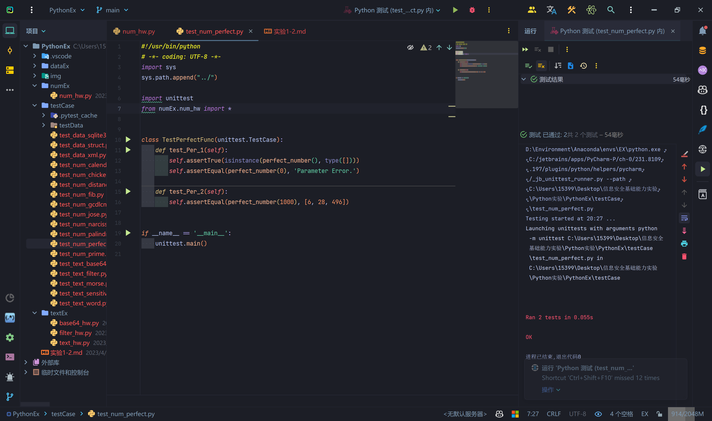
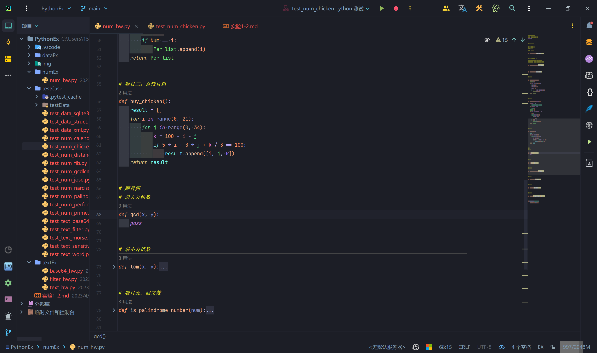

# 实验1-2实验报告

## 实验一

### 实验目的

``` blank
水仙花数(Narcissistic number) 是指一个 3位数，它每个位上的数字的3次幂之和等于它本身(例如:13 + 53+33 =153)。本题要求寻找所有的水仙花数
函数原型 narcissistic_number()
返回值: 返回一个 list，包含了所寻找到的全部水仙花数的数值，要求这些数从小到大排列。每一个数都应当为整形，如[153.370.3711。
```

### 实验过程

```blank
查看对应文件下的函数。
```


```blank
分析题目，可知数据范围为100-999，所以可以用for循环来遍历这个范围，然后对每个数进行判断，判断方法为将每个数的个位、十位、百位分别取出来，然后分别求出这个数的个位、十位、百位的三次方，将这三个数相加，如果相加的结果等于这个数，那么这个数就是水仙花数，将这个数添加到列表中。
```

```python
# 代码如下
def narcissistic_number():
    Nar_num = []
    for i in range(100, 1000):
        a = i // 100
        b = i // 10 % 10
        c = i % 10
        if a ** 3 + b ** 3 + c ** 3 == i:
            Nar_num.append(i)
    return Nar_num
```


```blank
运行测试代码，得到结果。测试通过。
```


---

## 实验二

### 实验目的

```blank
完全数(Perfect number)，又称完美数或完备数，是一些特殊的自然数。它所有的真因子(即除了自身以外的约数)的和(即因子函数)，恰好等于它本身。如果一个数恰好等于它的因子之和，则称该数为“完全数”。第一个完全数是 6，它有约数 1、2、3、6，除去它本身6 外，其余3个数相加，1+2+3=6。第二个完全数是 28，它有约数 1、2、4、7、14、28，除去它本身 28 外，其余5个数相加，1+2+4+7+14=28。第三个完全数是 496，有约数1、2、4、8、16、31、62、124、248、496，除去其本身496 外，其余9个数相加，1+2+4+8+16+31+62+124+248=496。题目要求寻找参数规定所有完美数
```

### 实验过程

```blank
查看对应文件下的函数。
```


```blank
分析题目，范围为0-limit，使用for循环遍历，并嵌套一个for循环来求得除了自己本身之外的所有因子，再将所有因子进行相加，最后求和便可判断出完美数。
```

```python
# 代码如下
def perfect_number(limit=1000):
    if limit <= 0:
        return "Parameter Error."
    elif limit is None:
        return []
    Per_list = []
    for i in range(1, limit + 1):
        Num = 0
        for j in range(1, i):
            if i % j == 0:
                Num += j
        if Num == i:
            Per_list.append(i)
    return Per_list
```


```blank
运行测试代码，得到结果。测试通过。
```



---

## 实验三

### 实验目的

```blank
鸡翁一值钱五，鸡母一值钱三，鸡雏三值钱一。百浅买百鸡，问鸡翁、鸡母、鸡雏各几
何?
```

### 实验过程

```blank
查看对应文件下的函数。
```


```blank
分析题目，可知这题需要有三个变量，并且可以列出两个三元方程，我们可以使用for循环来遍历这两个方程，然后将遍历出来的结果进行判断，如果满足条件，那么就将这个结果添加到列表中。
```

```python
# 代码如下
def buy_chicken():
    result = []
    for i in range(0, 21):
        for j in range(0, 34):
            k = 100 - i - j
            if 5 * i + 3 * j + k / 3 == 100:
                result.append([i, j, k])
    return result
```


```blank
运行测试代码，得到结果。测试通过。
```


---

## 实验四

### 实验目的

```blank
最大公约数和最小公倍数，gcd和lcm。
```

### 实验过程

```blank
查看对应文件下的函数。
```



```blank
分析题目，这题求解的是gcd和lcm，我们利用信息安全数学的知识，gcd(a,b)*lcm(a,b)=ab，可知，求得gcd(a,b)即可快速求出lcm，这里gcd采用欧几里得辗转相除法。
```

```python
# 最大公约数
def gcd(x, y):
    if x <= 0 or y <= 0:
        return "Parameter Error."
    if not isinstance(x, int) or not isinstance(y, int):
        return "Parameter Error."
    if x < y:
        x, y = y, x
    while y != 0:
        x, y = y, x % y
    return int(x)


# 最小公倍数
def lcm(x, y):
    if x <= 0 or y <= 0:
        return "Parameter Error."
    if not isinstance(x, int) or not isinstance(y, int):
        return "Parameter Error."
    return int(x * y / gcd(x, y))
```


```blank
运行测试代码，得到结果。测试通过。
```


---

## 实验五

### 实验目的

```blank
如果一个数反过来与原数相同，那么这就是一个回文数。比如，121 就是一个回文数-121 不是一个回文数。设计函数验证一个数是否为回文数。
```

### 实验过程

```blank
查看对应文件下的函数。
```


```blank
分析题目，这里我们可以使用字符串的切片来实现，将字符串反转，然后与原字符串进行比较，如果相同，那么就是回文数。
```

```python
# 代码如下
def is_palindrome_number(num):
    if num < 0:
        return False
    elif num == 0:
        return True
    else:
        num = str(num)
        if num == num[::-1]:
            return True
        else:
            return False
```


```blank
运行测试代码，得到结果。测试通过。
```


---

## 实验六

### 实验目的

```blank
素数指的是除了 1和它本身以外没有其他因数的数。设计函数验证一个数是否为素数。
```

### 实验过程

```blank
查看对应文件下的函数。
```


```blank
分析题目，可以使用for循环遍历从2开始一直到n-1的数是否能整除该数，如果可以整除，那么就不是素数，否则就是素数。
```

```python
# 代码如下
def is_prime_num(num):
    if not isinstance(num, int):
        return "Parameter Error."
    if num < 1:
        return "Parameter Error."
    if num == 1:
        return False
    for i in range(2, num):
        if num % i == 0:
            return False
    return True
```


```blank
运行测试代码，得到结果。测试通过。
```


---

## 实验七

### 实验目的

```blank
有 15个基督徒和 15个非基督徒在海上遇险，为了能让一部分人活下来不得不将其中15 个人扔到海里面去，有个人想了个办法就是大家围成一个圈，由某个人开始从 1 报数，报到9的人就扔到海里面，他后面的人接着从1开始报数，报到9的人继续扔到;海里面，直到扔掉 15 个人。由于上帝的保佑，15 个基督徒都幸免于难，问这些人最开始是怎么站的,哪些位置是基督徒哪些位置是非基督徒。假设初始有 m 人，最后有人存活，设计函数计算存活者的初始站立位置。
```

### 实验过程

```blank
查看对应文件下的函数。
```


```blank
分析题目，我们可以编写python程序仿真这一个过程，首先我们需要一个列表来存储这些人，然后我们需要一个变量来记录报数，当报数为9时，我们将对应列表的数值置0，再将报数的索引+2，如果报数的索引超过了列表的长度则取mod，最终剩下m个人即为基督徒。
```

```python
# 代码如下
def jose_prob(n, m):
    if not isinstance(n, int) or not isinstance(m, int):
        return "Parameter Error."
    Total = [True] * m
    count = 1
    while Total.count(True) > n:
        for i in range(m):
            if Total[i]:
                if count == 9:
                    Total[i] = False
                    count = 1
                else:
                    count += 1
    # 计算初始位置，1代表基督徒，0代表非基督徒
    result = []
    for i in range(m):
        if Total[i]:
            result.append(1)
        else:
            result.append(0)
    return result
```


```blank
运行测试代码，得到结果。测试通过。
```


---

## 实验八

### 实验目的

```blank
给出一个年月日，计算这一天是那一年的第几天.
```

### 实验过程

```blank
查看对应文件下的函数。
```


```blank
分析题目，本题可以用swtich语句进行判断，并且使用if语句判断是否为闰年。
```

```python
# 代码如下
def calendar(year, month, day):
    if year < 0 or month < 1 or month > 12 or day < 1 or day > 31:
        return "Parameter Error."
    if month == 2:
        if year % 4 == 0 and year % 100 != 0 or year % 400 == 0:
            if day > 29:
                return "Parameter Error."
        else:
            if day > 28:
                return "Parameter Error."
    days = 0
    for i in range(1, month):
        if i == 2:
            if year % 4 == 0 and year % 100 != 0 or year % 400 == 0:
                # 闰年
                days += 29
            else:
                days += 28
        elif i in [1, 3, 5, 7, 8, 10, 12]:
            # 大月
            days += 31
        else:
            # 小月
            days += 30
    days += day
    return days
```


```blank
运行测试代码，得到结果。测试通过。
```


---

## 实验九

### 实验目的

```blank
利用 Python 实现地球上两点之间的距离计算，地球上点的位置以经纬度坐标形式提供距离计算采用Haversine.
```

### 实验过程

```blank
查看对应文件下的函数。
```


```blank
分析题目，本题可以使用math库中的sin、cos、asin、acos、radians等函数进行计算，注意弧度制的转换。
```

```python
# 代码如下
def sphere_distance(p1, p2):
    import math
    def hav(theta: float) -> float:  # 弧度的hav值
        return (1 - math.cos(theta)) / 2

    def toRad(theta: float) -> float:  # 角度转弧度
        return theta * math.pi / 180

    R = 6371  # 地球半径
    lat1, lon1 = p1
    lat2, lon2 = p2
    if lat1 > 90 or lat1 < 0 or lat2 > 90 or lat2 < 0 or lon1 > 180 or lon1 < 0 or lon2 > 180 or lon2 < 0:
        return "Parameter Error."
    lat1, lon1, lat2, lon2 = map(toRad, [lat1, lon1, lat2, lon2])
    d = 2 * R * math.asin(math.sqrt(hav(lat2 - lat1) + math.cos(lat1) * math.cos(lat2) * hav(lon2 - lon1)))
    return round(d, 2)
```


```blank
运行测试代码，得到结果。测试通过。
```


---

## 实验十

### 实验目的

```blank
利用Python 实现Fibonacci 序列值的计算。实现两个函数:(1)递归版本的 Fibonacci 序列值计算，循环版本的Fibonacci 序列值计算。
```

### 实验过程

```blank
查看对应文件下的函数。
```


```blank
分析题目，本题可以使用递归和循环两种方法进行计算，注意递归的边界条件，Fibonacci递归公式为F(n)=F(n-1)+F(n-2)。
```

```python
# Fibonacci是1，1, 2，3，5, 8，13.....
# n1 = 1, n2 =2, n3 = n1+n2, n4 = n3+n2
def fibonacci_recursion(number):
    if isinstance(number, int) and number > 0:
        if number == 1 or number == 2:
            return 1
        else:
            return fibonacci_recursion(number - 1) + fibonacci_recursion(number - 2)
    else:
        return "Parameter Error."


def fibonacci_loop(number):
    if isinstance(number, int) and number > 0:
        if number == 1 or number == 2:
            return 1
        else:
            a = 1
            b = 1
            for i in range(3, number + 1):
                a, b = b, a + b
            return b
    else:
        return "Parameter Error."
```


```blank
运行测试代码，得到结果。测试通过。
```


---

## 实验十一

### 实验目的

```blank
利用 Python实现摩斯码符号生成。
```

### 实验过程

```blank
查看对应文件下的函数。
```


```blank
分析题目，本题可以使用字典进行存储，注意字典的键值对的存储，同时注意，写出的程序字符之间本身自带三个空格，因此如果此时准备处理的字符为空格，那么只需增加四个空格即可，因为上个字符后附带的三个空格加上此时四个空格为七个空格，即单词之间的间隔。
```

```python
# 代码如下
def morse_code(usr_str):
    dict = {
        'A': '. -',
        'B': '- . . .',
        'C': '- . - .',
        'D': '- . .',
        'E': '.',
        'F': '. . - .',
        'G': '- - .',
        'H': '. . . .',
        'I': '. .',
        'J': '. - - -',
        'K': '- . -',
        'L': '. - . .',
        'M': '- -',
        'N': '- .',
        'O': '- - -',
        'P': '. - - .',
        'Q': '- - . -',
        'R': '. - .',
        'S': '. . .',
        'T': '-',
        'U': '. . -',
        'V': '. . . -',
        'W': '. - -',
        'X': '- . . -',
        'Y': '- . - -',
        'Z': '- - . .',
        '0': '- - - - -',
        '1': '. - - - -',
        '2': '. . - - -',
        '3': '. . . - -',
        '4': '. . . . -',
        '5': '. . . . .',
        '6': '- . . . .',
        '7': '- - . . .',
        '8': '- - - . .',
        '9': '- - - - .',
    }
    usr_str = usr_str.upper()
    result = ''
    for i in usr_str:
        if i == ' ':
            result += '    '
        else:
            result += dict[i] + '   '
    return result.strip()
```


```blank
运行测试代码，得到结果。测试通过。
```


---

## 实验十二

### 实验目的

```blank
利用 Python 从文本文件中提取出现频次前十的单词.
```

### 实验过程

```blank
查看对应文件下的函数。
```


```blank
分析题目，这里同样使用字典对单词进行统计，然后通过迭代字典的方式，找出出现频次前十的单词。
```

```python
# 代码如下
def word_freq(path):
    import re
    with open("./testData/sight word.txt", 'r') as f:
        sight_words = f.readline().split()
    with open(path, 'r') as f:
        lines = f.readlines()
        words = []
        for line in lines:
            # 去除标点符号 !~@#$%^&*()_-+=[]{}/?,.:\"<>
            line = re.sub(r'[!~@#$%^&*()_\-+=\[\]{}/?,.:\"<>]', ' ', line)
            words += line.split(' ')
        words = [word.lower() for word in words]
        freq = {}
        for word in words:
            word = word.strip()
            if word in sight_words:
                continue
            if word not in freq and word != '' and word != '\n':
                freq[word] = 1
            elif word != '' and word != '\n':
                freq[word] += 1
        freq['i'] = 0
    # lambda x: (x[1], x[0]) 以x[1]为主要排序，x[0]为次要排序，x[1] 降序, x[0] 降序
    freq = sorted(freq.items(), key=lambda x: (x[1], x[0]), reverse=True)
    return freq[:10]
```


```blank
运行测试代码，得到结果。测试通过。
```


