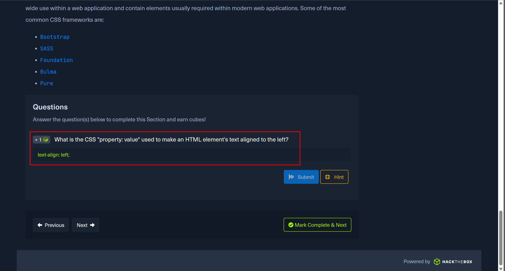
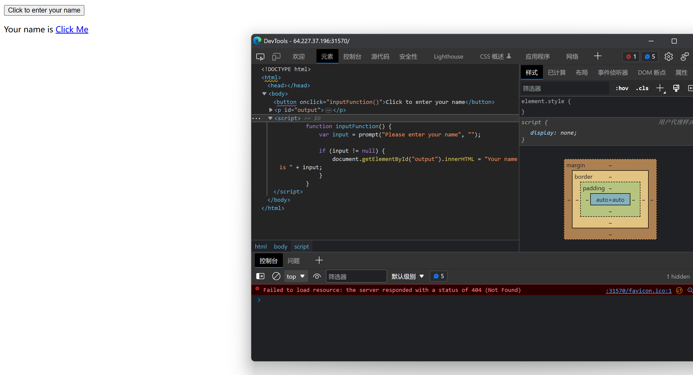
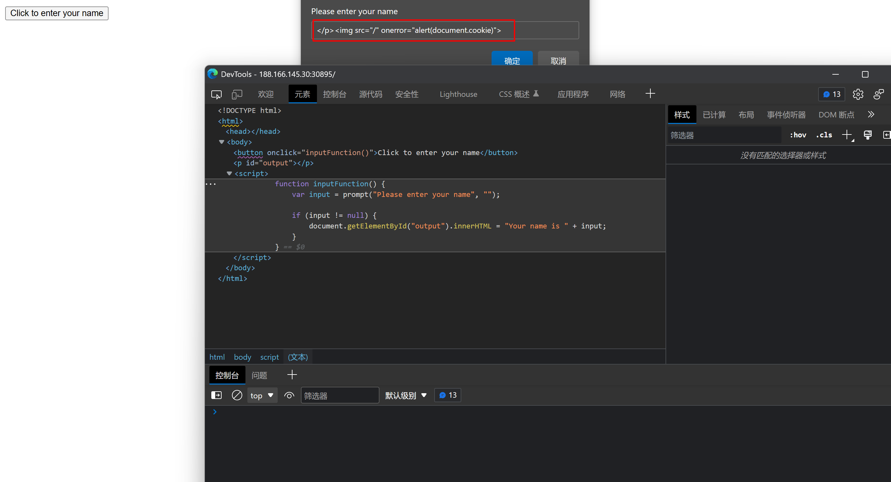

# 实验1-11实验报告

## 实验一

```blank
What is the HTML tag used to show an image?
```

### 解题思路

```blank
1.通过查阅w3c文档，发现img标签用于显示图像。
```

### 结果截图


---

## 实验二

```blank
What is the CSS "property: value" used to make an HTML element's text aligned to the left?
```

### 解题思路

```blank
1.通过查阅w3c文档，发现text-align属性用于设置文本的水平对齐方式。其属性值有left、right、center、justify。分别代表左对齐、右对齐、居中对齐、两端对齐。
```

### 结果截图



---

## 实验三

```blank
Check the above login form for exposed passwords. Submit the password as the answer.
```

### 解题思路

```blank
1.进入登录页面，F12查看源代码，发现密码明文显示。
```


### 结果截图


---

## 实验四

```blank
What text would be displayed on the page if we use the following payload as our input: <a href="http://www.hackthebox.com">Click Me</a>
```

### 解题思路

```blank
1.F12开发者控制栏，可以看到javascript函数为直接替换标签，而不是转义。所以可以直接输入html标签，实现跳转。
```


```blank
2.输入 <a href="http://www.hackthebox.com">Click Me</a> ，点击submit，页面跳转到hackthebox.com。
```



### 结果截图


---

## 实验五

```blank
Try to use XSS to get the cookie value in the above page
```

### 解题思路

```blank
1.F12开发者控制栏，可以看到javascript函数为直接替换标签，而不是转义。所以可以直接输入html语句进行xss注入。
```

```html
</p>
```

```blank
2.<p>标签用于显示文本，img标签用于显示图像，onerror事件用于在加载图像时发生错误时执行的脚本，alert()函数用于显示警告框。
```



```blank
3.点击submit，弹出cookie值。
```


### 结果截图


---

## 实验六

```blank
What operating system is 'WAMP' used with?
```

### 解题思路

```blank
1.查阅资料，WAMP代表Windows、Apache、MySQL、PHP。所以是Windows操作系统。
```

### 结果截图


---

## 实验七

```blank
If a web server returns an HTTP code 201, what does it stand for?
```

### 解题思路

```blank
1.查阅资料，HTTP状态码201代表Created。表示请求成功并且服务器创建了新的资源。因此本题答案为Created。
```

### 结果截图


---

## 实验八

```blank
What type of database is Google's Firebase Database?
```

### 解题思路

```blank
1.查阅资料，Firebase是Google推出的一款移动应用开发平台，提供了后端云服务，包括数据库、存储、身份验证、分析、机器学习等。因此本题答案为NOSQL。
```

### 结果截图


---

## 实验九

```blank
Use GET request '/index.php?id=0' to search for the name of the user with id number 1?
```

### 解题思路

```blank
1.直接在浏览器中构造请求http://157.245.39.81:30996/index.php?id=1，可以看到返回结果为superadmin。
```


### 结果截图


---

## 实验九

```blank
To which of the above categories does public vulnerability 'CVE-2014-6271' belongs to?
```

### 解题思路

```blank
1.查阅资料，CVE-2014-6271为EternalBlue（永恒之蓝）是方程式组织在其漏洞利用框架中一个针对SMB服务进行攻击的模块。属于Command Injection。原理为利用Windows系统的SMB协议漏洞来获取系统的最高权限。
```

### 结果截图


---

## 实验十一

```blank
What is the CVSS score of the public vulnerability CVE-2017-0144?
```

### 解题思路

```blank
1.CVSS是一种用于衡量计算机漏洞危害程度的标准，其分为三个维度：基础分数、环境分数、临时分数。CVE-2017-0144由于其涉及漏洞的影响广泛性及利用稳定性，在被公开以后为破坏性巨大的勒索蠕虫 WannaCry所用而名噪一时。它的CVSS分数为 9.3。
```

### 结果截图


---