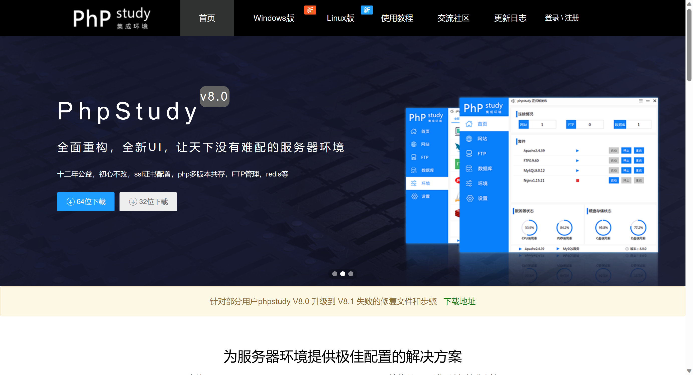
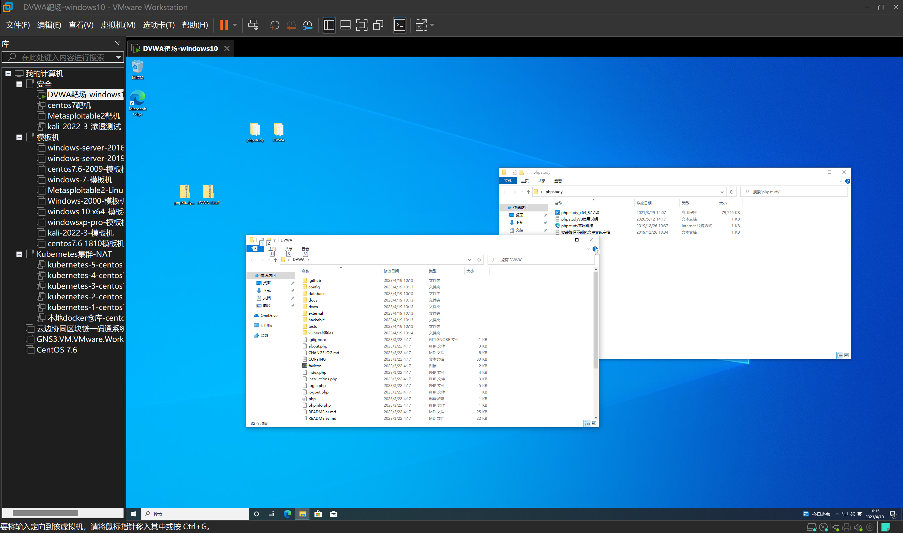
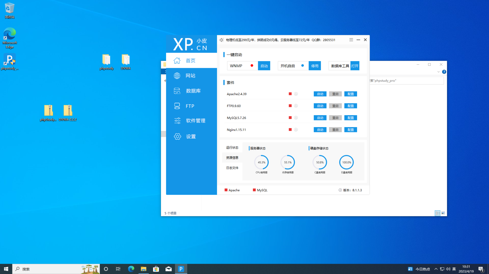
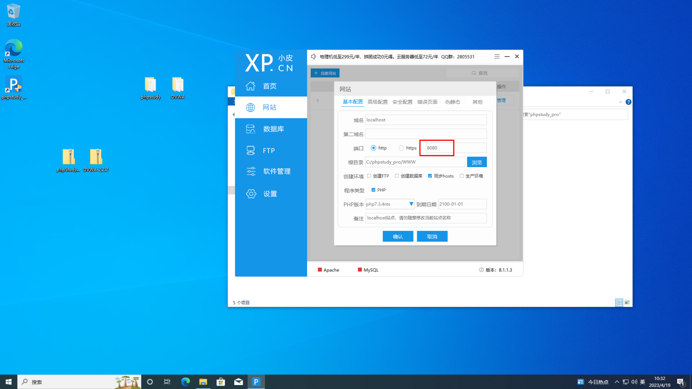
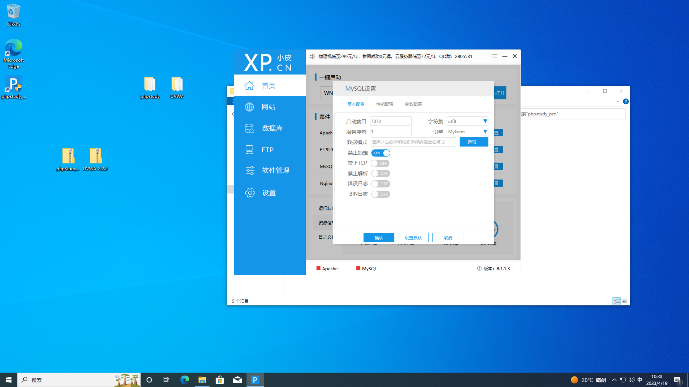
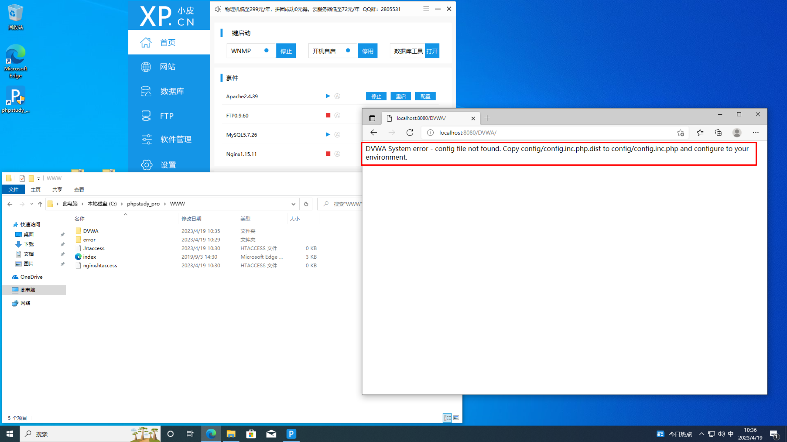
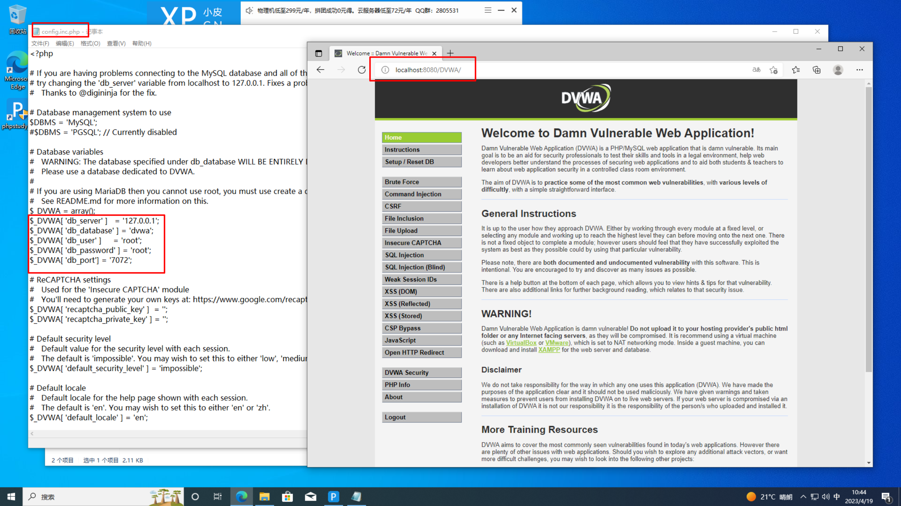
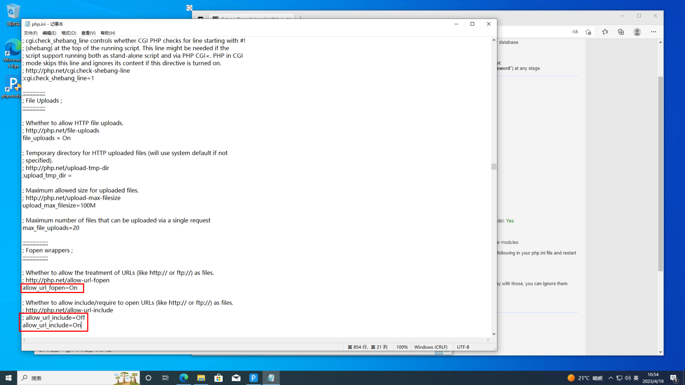
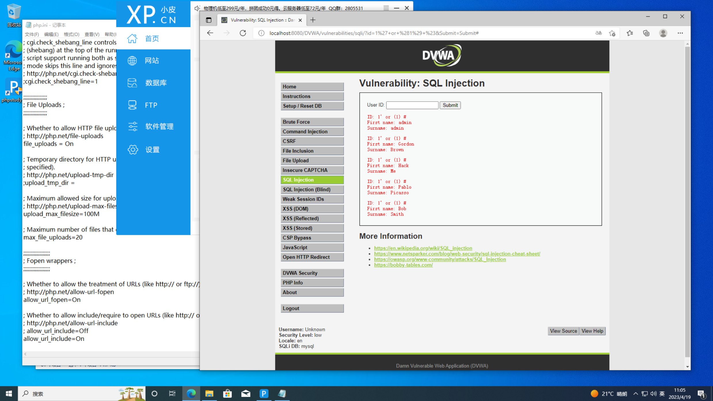

# 实验1-6实验报告

## 实验一

### 实验目的

搭建DVWA靶机环境（参考视频DVWA安装）

### 实验过程

1.下载PHPStudy服务器配置环境。



2.创建Windows10虚拟机，将PHPStudy和DVWA文件夹放入虚拟机中。



3.安装phpstudy。



4.配置php网站端口信息，这里修改端口为8080。



5.配置数据库信息，将启动端口改为7072。



6.启动phpstudy，然后将DVWA文件放入phpstudy的www文件夹中，在浏览器输入localhost:8080/DVWA/，可看到DVWA的配置错误信息。



7.进入DVWA的config文件夹下修改config.inc.php.dist文件如下，将改好的文件以config.inc.php进行保存。

```shell
$_DVWA[ 'db_user' ]     = 'root'; # MySQL 用户名
$_DVWA[ 'db_password' ] = 'root'; # MySQL 用户密码
$_DVWA[ 'db_port'] = '7072';    # MySQL 端口
```

8.再次刷新页面，可看到DVWA网页已经出来了。



9.点击create / reset database，创建数据库。


10.这里可以看到allow_url_fopen = On和allow_url_include = On，这里标红了，需要进入Extensions\php\php7.3.4nts中修改php.ini文件，修改后重启apache服务器。



11.使用SQL注入漏洞，输入`' or 1=1#`，可以看到登录成功，靶场环境搭建完成。

```sql
'order by 1#'
```



---

## 实验二