# 实验1-6实验报告

## 实验一

### 实验目的

搭建DVWA靶机环境（参考视频DVWA安装）

### 实验过程

1.下载PHPStudy服务器配置环境。


2.创建Windows10虚拟机，将PHPStudy和DVWA文件夹放入虚拟机中。


3.安装phpstudy。


4.配置php网站端口信息，这里修改端口为8080。


5.配置数据库信息，将启动端口改为7072。


6.启动phpstudy，然后将DVWA文件放入phpstudy的www文件夹中，在浏览器输入localhost:8080/DVWA/，可看到DVWA的配置错误信息。


7.进入DVWA的config文件夹下修改config.inc.php.dist文件如下，将改好的文件以config.inc.php进行保存。

```shell
$_DVWA[ 'db_user' ]     = 'root'; # MySQL 用户名
$_DVWA[ 'db_password' ] = 'root'; # MySQL 用户密码
$_DVWA[ 'db_port'] = '7072';    # MySQL 端口
```

8.再次刷新页面，可看到DVWA网页已经出来了。


9.点击create / reset database，创建数据库。

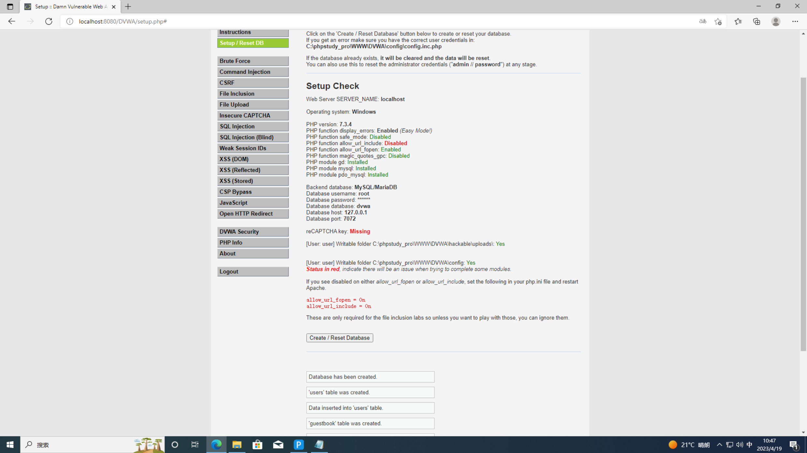

10.这里可以看到allow_url_fopen = On和allow_url_include = On，这里标红了，需要进入Extensions\php\php7.3.4nts中修改php.ini文件，修改后重启apache服务器。


11.使用SQL注入漏洞，输入`' or 1=1#`，可以看到登录成功，靶场环境搭建完成。

```sql
'order by 1#'
```


---

## 实验二

### 实验目的

CTFHUB：请求方式

### 实验过程

1.打开CTFHUB，进入题目。

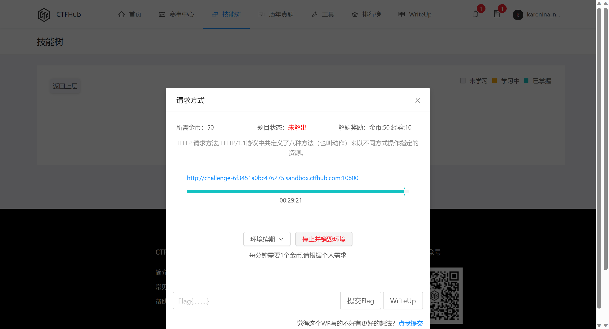

2.网站显示信息如下

```blank
HTTP Method is GET

Use CTF**B Method, I will give you flag.


Hint: If you got 「HTTP Method Not Allowed」 Error, you should request index.php.
```

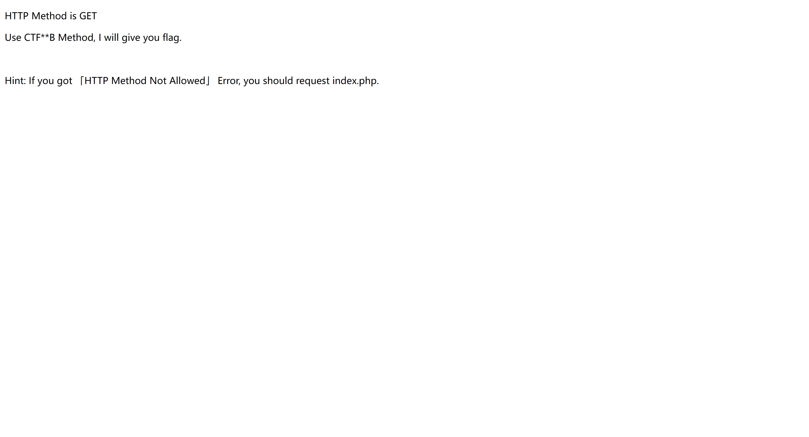

3.使用cmd中的curl命令来请求，将请求方式改成CRFHUB，能够看到题目的flag为ctfhub{f93be3e3e349e59618cb8483}。

```shell
curl -v -X CTFHUB http://challenge-6f3451a0bc476275.sandbox.ctfhub.com:10800/index.php
```

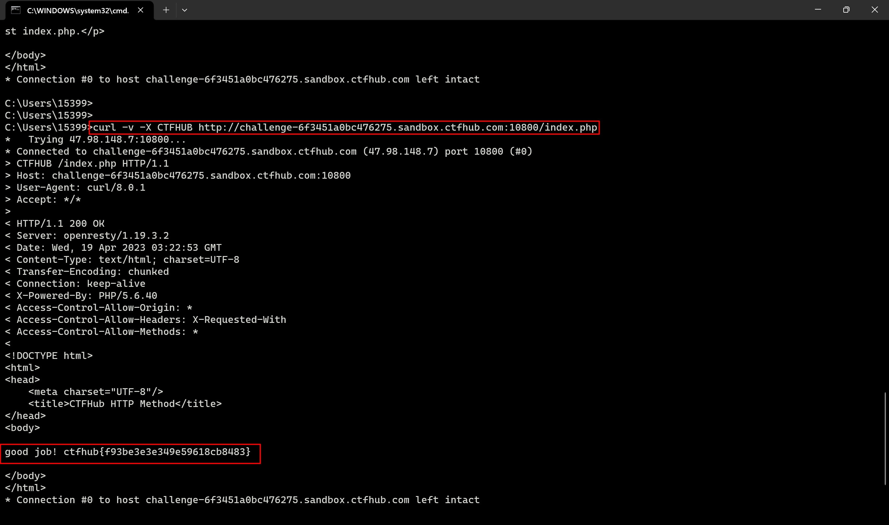

4.提交flag，得到分数。

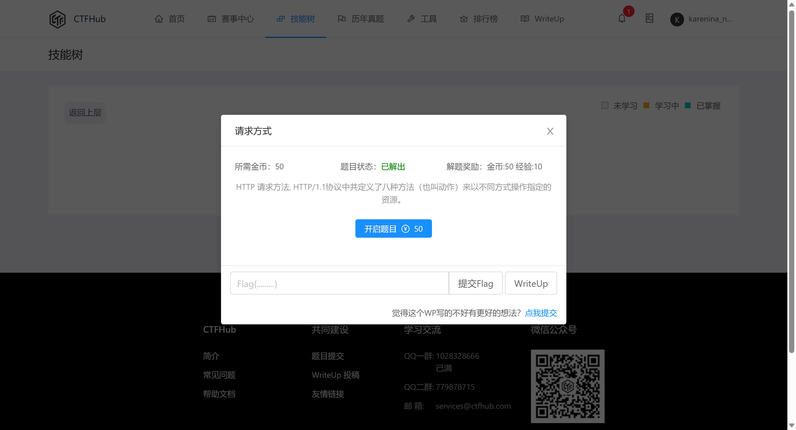

---

## 实验三

### 实验目的

CTFHUB：302跳转

### 实验过程

1.打开CTFHUB，进入题目。

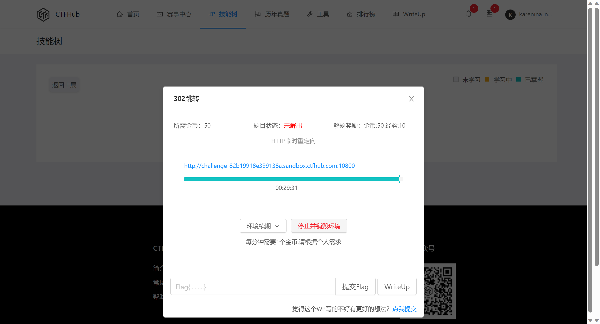

2.网站显示信息如下


3.此题考查302跳转，F12打开开发者控制栏，刷新页面，得到网络请求信息，可以看有302跳转的内容。

```shell
http://challenge-82b19918e399138a.sandbox.ctfhub.com:10800/favicon.ico
```

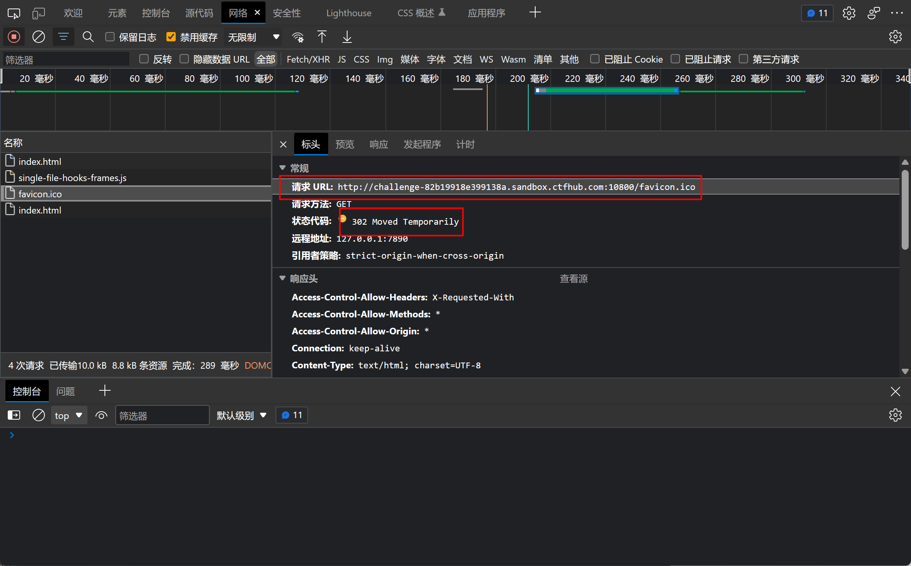

4.使用curl请求该路径，得到flag为ctfhub{f4ea468da2c788e4b20bd260}。

```shell
curl http://challenge-82b19918e399138a.sandbox.ctfhub.com:10800/favicon.ico
```

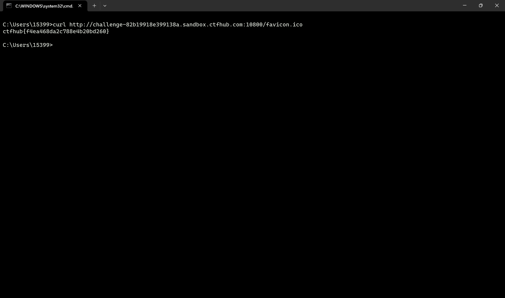

5.提交flag，得到分数。

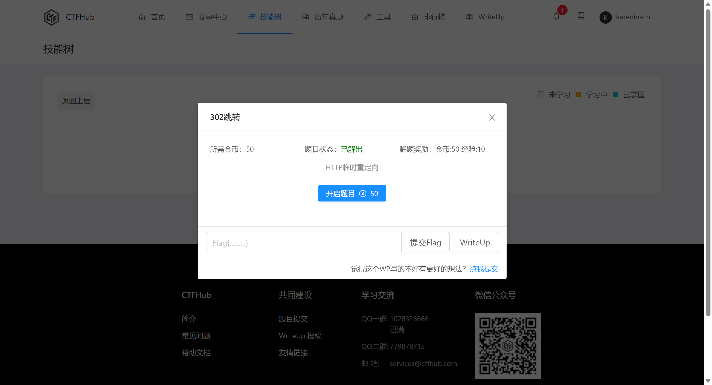

---

## 实验四

### 实验目的

CTFHUB：Cookie

### 实验过程

1.打开CTFHUB，进入题目。

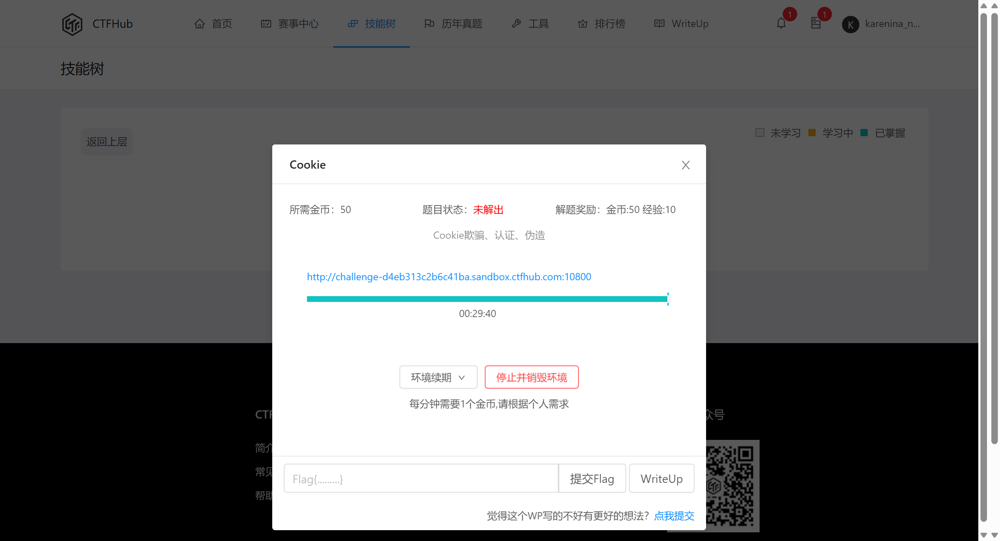

2.网站显示信息如下


3.F12打开开发者控制栏，刷新页面，得到网络请求信息，可以看到cookie信息，其中有一条为admin=0。

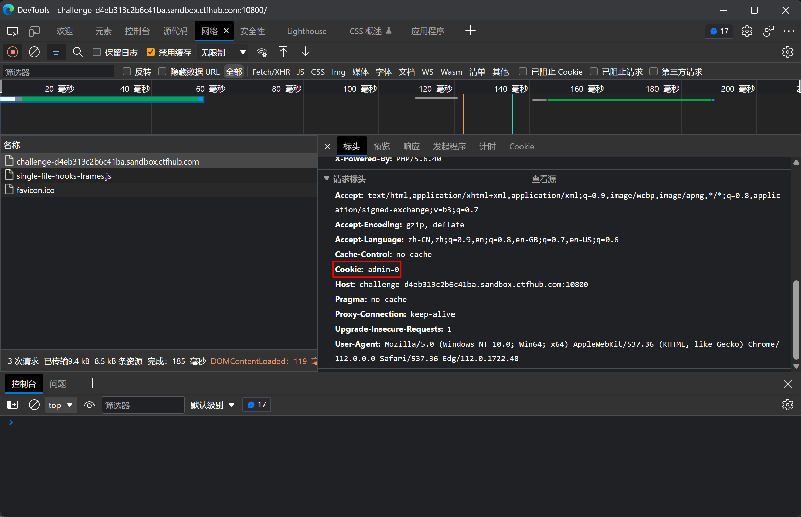

4.进入cookie中修改admin的值为1，刷新页面，得到flag为ctfhub{4ffa2d79167482cc7c6b6af6}

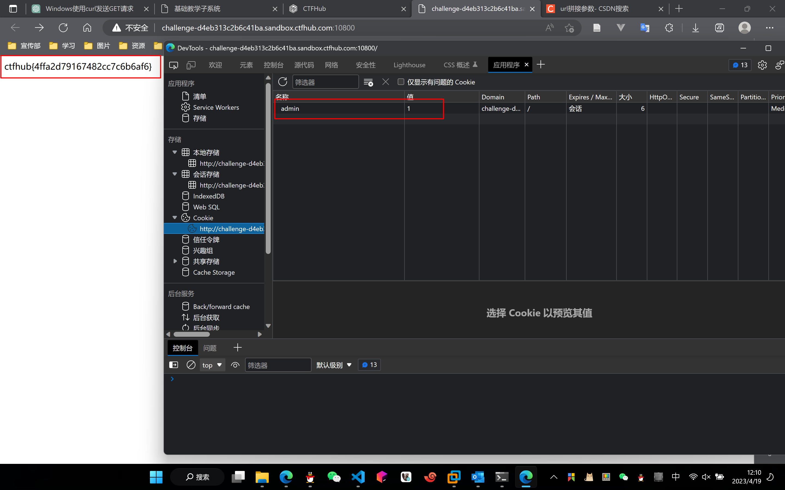

5.提交flag，得到分数。

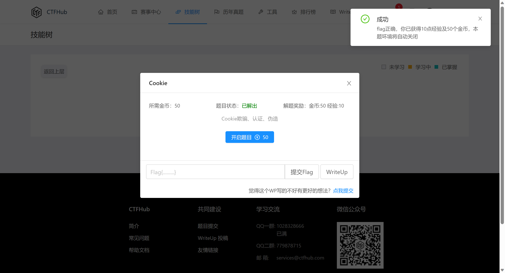