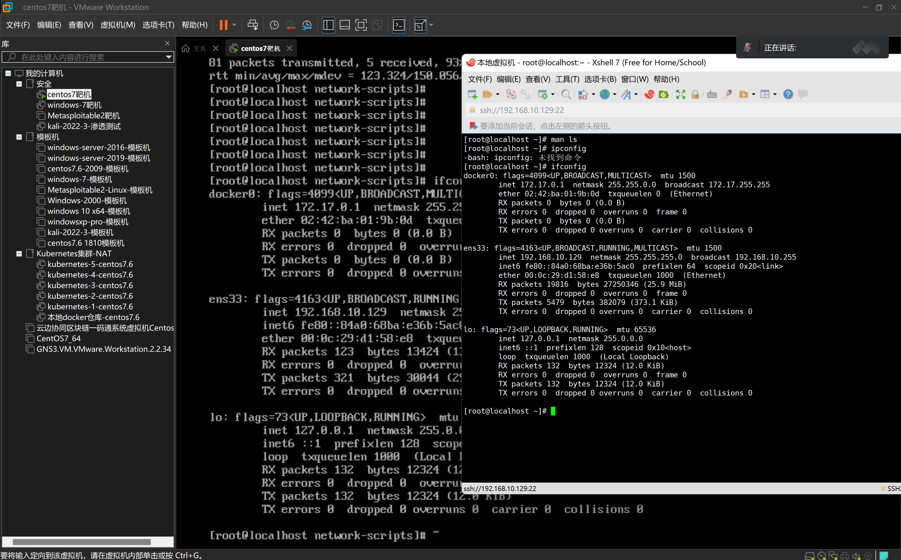
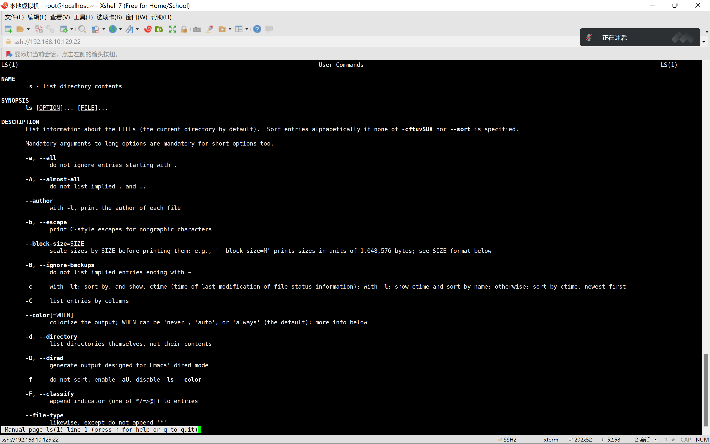
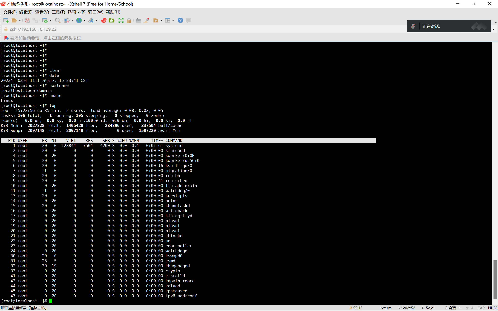
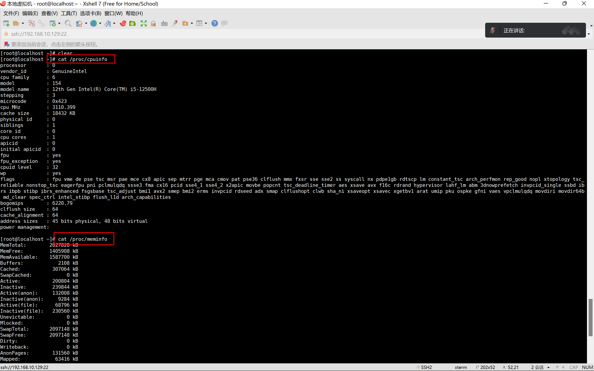
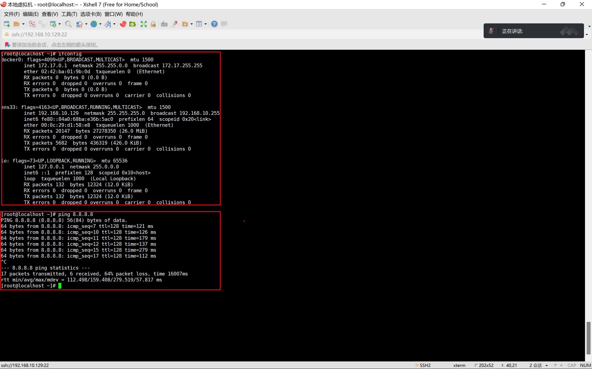
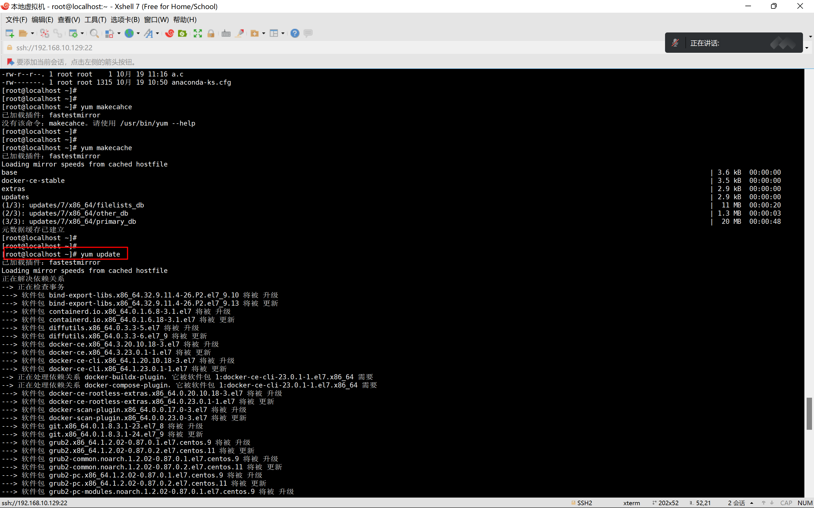
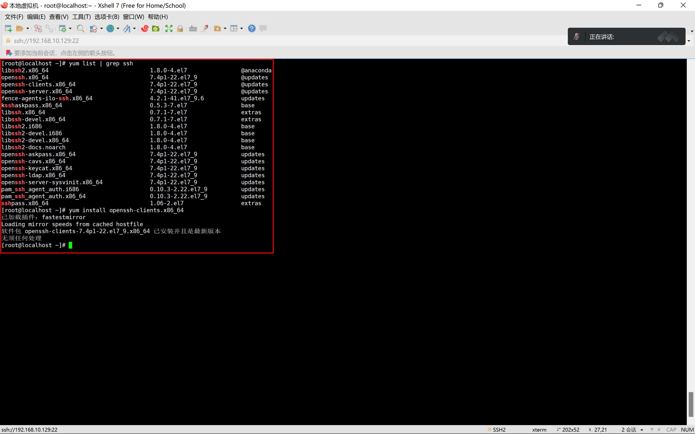

# 实验1-4实验报告

## 实验一

### 实验目的

``` blank
1.熟悉VirtualBox等虚拟机用法，并配置Ubuntu Linux实验环境
2.了解和使用Linux常用shell工具，并掌握通用的帮助或手册用法
3.能够使用基础命令查看主机名、网络配置
4.能够查看CPU、内存配置与使用状态以及系统内核版本与发行版本
5.能够完成与宿主机的网络配置，理解不同网络配置类型的区别
6.能够对常用软件镜像源进行修改
7.能够在Linux环境中配置SSH服务
8.熟练使用命令行或GUI工具通过SSH远程连接Linux
```

### 实验过程

```blank
安装虚拟机，选用Centos7.6版本的Linux发行版
```


```blank
配置虚拟机静态IP，并连接shell。
IP地址为 192.168.10.129 ，子网掩码为 255.255.255.0 ，网关为192.168.10.254
```



```blank
使用man命令查看ls手册内容
```



```blank
使用date、hostname、top、uname命令查看相应系统信息，命令信息含义如下
date：显示当前日期和时间
hostname：显示主机名
top：显示当前系统进程信息
uname：显示系统信息
```



```blank
使用cat查看cpu和内存信息，命令如下
```

```bash
cat /proc/cpuinfo # 查看cpu信息
cat /proc/meminfo # 查看内存信息
```



```blank
比较桥接模式、Host-Only进行配置、Nat进行网卡配置。其中Nat模式能上网，需要配置主机IP、子网掩码、默认网关、Dns服务器地址。
```




```blank
使用yum update更新软件，需要将yum换源
```



```blank
安装ssh服务，由于以前安装过ssh，因此这里显示的是已经是最新版
```



```blank
使用xshell登录ssh，本实验开始已经使用xshell进行登录
```


---

## 实验二

### 实验目的

``` blank
1.学习使用常用命令: ls，cd，cat，find，file
2.理解基本的用户与文件权限
```

### 实验过程

[1.开启实验环境，使用xshell连接实验2环境](./img/%E8%BF%9E%E6%8E%A5%E5%AE%9E%E9%AA%8C2%E7%8E%AF%E5%A2%83.png)

[2.查看用户目录下readme文件内容，为ieEWq6ht](./img/%E6%9F%A5%E7%9C%8Breadme%E6%96%87%E4%BB%B6%E5%86%85%E5%AE%B9.png)

[3.使用lesson01-1用户名登录，密码为ieEWq6ht](./img/lesson01-1%E7%94%A8%E6%88%B7%E5%90%8D%E7%99%BB%E5%BD%95.png)

[4.查看文件名为-的内容，为gy5f6rs7](./img/%E6%9F%A5%E7%9C%8B%E6%96%87%E4%BB%B6%E5%90%8D%E4%B8%BA-%E7%9A%84%E5%86%85%E5%AE%B9.png)

[5.使用lesson01-2用户名登录，密码为gy5f6rs7](./img/lesson01-2%E7%94%A8%E6%88%B7%E5%90%8D%E7%99%BB%E5%BD%95.png)

[6.查看文件名为space_in_this_tilename的内容，为iJpMOHR5](./img/%E6%9F%A5%E7%9C%8B%E6%96%87%E4%BB%B6%E5%90%8D%E4%B8%BAspace%E7%9A%84%E5%86%85%E5%AE%B9.png)

[7.使用lesson01-3用户名登录，密码为iJpMOHR5](./img/lesson01-3%E7%94%A8%E6%88%B7%E5%90%8D%E7%99%BB%E5%BD%95.png)

[8.查看主目录下隐藏文件内容，命令，为S5O0FGZb](./img/%E6%9F%A5%E7%9C%8B%E4%B8%BB%E7%9B%AE%E5%BD%95%E4%B8%8B%E9%9A%90%E8%97%8F%E6%96%87%E4%BB%B6%E5%86%85%E5%AE%B9.png)

```bash
ls -a
```

[9.使用lesson01-4用户名登录，密码为S5O0FGZb](./img//lesson01-4%E7%94%A8%E6%88%B7%E5%90%8D%E7%99%BB%E5%BD%95.png)

[10.查看主目录下asci2格式文本文件内容，查看文件类型，发现(7)为ascii类型，内容为](./img/%E6%9F%A5%E7%9C%8B%E6%96%87%E4%BB%B6%E7%B1%BB%E5%9E%8B.png)

```bash
file filename
```

[11.查看ascii文件内容，内容为s3XECIPV](./img/%E6%9F%A5%E7%9C%8Bascii%E6%96%87%E4%BB%B6%E5%86%85%E5%AE%B9.png)

[12.使用lesson01-5我用户名登录，密码为s3XECIPV](./img/lesson01-5%E7%94%A8%E6%88%B7%E5%90%8D%E7%99%BB%E5%BD%95.png)

[13.使用命令查找maybehere目录，查看该文件夹满足以下条件文件的内容:“文件大小为1008字节，文本文件，不可执行”](./img/%E6%9F%A5%E6%89%BEmaybehere%E7%9B%AE%E5%BD%95.png)

```bash
find maybehere -type f -size 1008c ! -executable -exec sh -c 'file "{}" | grep -q "text"' \; -print
```

```blank
该命令中，maybehere是要查找的目录名称，-type f表示只查找文件，-size 1008c表示文件大小为1008字节，! -executable表示文件不可执行，-exec选项用于执行file和grep命令以检查文件类型是否为文本文件，最后使用-print选项将符合条件的文件名打印出来。
```

[14.查看该文件，最后八字符为gHm7YP4l](./img/%E6%9C%80%E5%90%8E%E5%85%AB%E5%AD%97%E7%AC%A6%E4%B8%BA%E5%AF%86%E7%A0%81.png)

[15.使用lesson01-6用户名登录，密码为gHm7YP4l](./img/lesson01-6%E7%94%A8%E6%88%B7%E5%90%8D%E7%99%BB%E5%BD%95.png)

[16.查找满足以下条件文件:“在/var路径下，属于用户lesson01-6、属于用户组esson01-5、件大小为50字节”，内容为WXVxFCI2ZyrKIlmyGuqDdfmafvNspT9jZ9d1wWqTUnx4jYq8w0](./img/%E6%9F%A5%E6%89%BE%E6%8C%87%E5%AE%9A%E7%94%A8%E6%88%B7%E5%92%8C%E7%94%A8%E6%88%B7%E7%BB%84%E4%B8%8E%E6%96%87%E4%BB%B6%E5%A4%A7%E5%B0%8F%E7%9A%84%E6%96%87%E4%BB%B6.png)

```bash
find /var -user lesson01-6 -group lesson01-5 -size 50c -exec cat {} \;
```

```blank
find /var: 在 /var 目录下查找文件。
-user lesson01-6: 查找属于用户 lesson01-6 的文件。
-group lesson01-5: 查找属于用户组 lesson01-5 的文件。
-size 50c: 查找大小为 50 字节的文件，其中 c 表示字节单位。
-exec cat {} \;: 对于每个找到的文件，执行 cat 命令并输出其内容。其中 {} 表示找到的文件名，\; 表示命令的结束。
```

[17.使用lesson01-7用户名登录，密码为x4jYq8w0](./img/lesson01-7%E7%94%A8%E6%88%B7%E5%90%8D%E7%99%BB%E5%BD%95.png)

[18.获取/etc/lesson01_pass内容。观察到由于文件在系统目录/etc，因此普通的cat获取不到，我们使用ls命令可看到本地有两个newcat可执行文件](./img/newcat%E5%8F%AF%E6%89%A7%E8%A1%8C%E6%96%87%E4%BB%B6.png)

```blank
执行newcat2
```

[19.通过尝试可以知道newcat2能够越过权限访问目录下文件，为RNclQnRG](./img/lesson_pass%E6%96%87%E4%BB%B6.png)

[19.观察主目录中文件内容及权限。](./img/%E6%96%87%E4%BB%B6%E6%9D%83%E9%99%90%E4%BF%A1%E6%81%AF.png)

```bash
-rwxr-xr-x 1 lesson01-8 lesson01-8 14232 Mar 11 13:57 newcat1
-rwsrwxrwx 1 lesson01-8 lesson01-8 14232 Mar 11 13:57 newcat2
```

```blank
-rwxr-xr-x: 权限信息。由左到右依次是文件类型和权限，其中 - 表示普通文件，rwx 表示所有者有读、写、执行权限，r-x 表示所属组有读、执行权限，r-x 表示其他用户有读、执行权限。
1: 硬链接数。表示指向该文件的硬链接数量。
第一个lesson01-8: 文件所有者。
第二个lesson01-8: 文件所属组。
14232: 文件大小。表示文件占用的字节数。
Mar 11 13:57: 文件最后一次修改的时间。
newcat1 或 newcat2: 文件名。
```

[20.使用md5sum来观察主目录下的两个文件否相同。](./img/md5sum%E6%AF%94%E8%BE%83%E6%96%87%E4%BB%B6%E6%98%AF%E5%90%A6%E7%9B%B8%E5%90%8C.png)

```bash
a32912f55c44a7fd452ee4cd11359ba1  ./newcat1
a32912f55c44a7fd452ee4cd11359ba1  ./newcat2
```

```blank
根据 md5sum 命令的输出信息可以看出，newcat1 和 newcat2 的 MD5 摘要值相同，都是 a32912f55c44a7fd452ee4cd11359ba1。这意味着这两个文件的内容完全相同，即它们的二进制数据完全一致。

这可能是因为这两个文件是同一个程序的不同版本或者副本，或者是通过某种方式进行了复制，例如使用 cp 命令或者复制粘贴等方式。
```

---

## 实验三

### 实验目的

``` blank
1.巩固使用常用命令:ls，cd，cat，find，file
2.学习使用常用命令: grep，sort，uniq，strings，diff
```

### 实验过程

[1.实验三lesson02用户名密码登录](./img/%E5%AE%9E%E9%AA%8C%E4%B8%89%E7%99%BB%E5%BD%95.png)

[2.查找文件data.txt中，单词”millionth”后到段落结尾的文本内容，为TESKZC0XvTetK0ObTUeMb5STk5iWrBvP](./img/%E6%9F%A5%E6%89%BEmillionth%E5%90%8E%E7%9A%84%E5%86%85%E5%AE%B9.png)

```blank
在vim界面中使用 /单词 来查找某单词
```

[3.使用用户名lesson02-1登录，密码为TESKZC0XvTetK0ObTUeMb5STk5iWrBvP](./img/lesson02-1%E7%94%A8%E6%88%B7%E5%90%8D%E7%99%BB%E5%BD%95.png)

[4.查找文件data.txt中，仅出现一次的文本行,内容为EN632PlfYiZbn3PhVK3XOGSlNInNE00t](./img/%E6%9F%A5%E6%89%BE%E4%BB%85%E5%87%BA%E7%8E%B0%E4%B8%80%E6%AC%A1%E7%9A%84%E8%A1%8C%E8%BE%93%E5%87%BA.png)

```bash
sort data.txt | uniq -u
```

```blank
这个命令将会按行排序文件data.txt，并将排序后的结果传递给uniq命令。uniq命令将会删除文件中所有重复的行，并且只保留唯一的行。其中，-u选项表示只输出出现一次的行，-u选项不能和-d选项同时使用。因此，最终输出的结果将是文件中仅出现一次的行。
```

[5.使用用户名lesson02-2登录，密码为EN632PlfYiZbn3PhVK3XOGSlNInNE00t](./img/lesson02-2%E7%94%A8%E6%88%B7%E5%90%8D%E7%99%BB%E5%BD%95.png)

[6.查找文件data.txt中，查找以几个“=“开头的ASCII字符串，内容为G7w8LIi6J3kTb8A7j9LgrywtEUlyyp6s](./img/%E5%A4%9A%E4%B8%AA%3D%E5%BC%80%E5%A4%B4%E7%9A%84%E5%8D%95%E8%AF%8D.png)

```bash
strings -n 1 data.txt | grep '.*=.*'
```

```blank
这个命令将会使用strings命令查找文件data.txt中的ASCII字符串。然后，使用grep命令查找几个“=”的ASCII字符串。其中，-n 1选项表示只查找长度为1的ASCII字符串。
```

[7.使用用户名lesson02-3登录，密码为G7w8LIi6J3kTb8A7j9LgrywtEUlyyp6s](./img/lesson02-3%E7%94%A8%E6%88%B7%E5%90%8D%E7%99%BB%E5%BD%95.png)

[8.查找文件passwords.old和passwords.new，比较password.old和password.new文件内容，获取已更改的行内容](./img/diff%E5%AF%B9%E6%AF%94%E5%B7%AE%E5%BC%82.png)

```bash
diff passwords.old passwords.new | grep '<\|>'
```

```blank
这个命令将 passwords.old 和 passwords.new 两个文件进行比较，并将 diff 命令输出的结果传递给 grep 命令。grep 命令使用正则表达式模式 '<\|>' 匹配包含 < 或 > 符号的行，这些符号指示了两个文件之间的差异。
```

```blank
更改内容为
< 810zq8IK64u5A9Lb2ibdTGBtlcSZsoe8
> hga5tuuCLF6fFzUpnagiMN8ssu9LFrdg
```

---

## 实验四

### 实验目的

``` blank
1.学习使用常用命令: crontab
2.能够阅读理解简单的Shell脚本
```

### 实验过程

[1.实验四账号lesson03密码登录](./img/lesson03-1%E7%94%A8%E6%88%B7%E5%90%8D%E7%99%BB%E5%BD%95.png)

[2.进入目录/etc/cron.d](./img/%E8%BF%9B%E5%85%A5%E7%9B%AE%E5%BD%95%E5%B9%B6%E6%9F%A5%E7%9C%8B%E7%9B%AE%E5%BD%95%E4%B8%8B%E6%96%87%E4%BB%B6.png)

[3.使用vim读取cronjob-lesson03_1的内容](./img/cronjob-lesson03_1%E5%86%85%E5%AE%B9.png)

```bash
@reboot lesson03-1 /usr/bin/lesson03_shell1.sh &> /dev/null
* * * * * lesson03-1 /usr/bin/lesson03_shell1.sh &> /dev/null
```

```blank
@reboot lesson03-1 /usr/bin/lesson03_shell1.sh &> /dev/null 内容如下:
表示在系统启动时执行 /usr/bin/lesson03_shell1.sh 脚本，lesson03-1 是指定执行该脚本的用户，&> /dev/null 则表示将该脚本的所有输出都重定向到 /dev/null，即丢弃输出。
```

```blank
* * * * * lesson03-1 /usr/bin/lesson03_shell1.sh &> /dev/null 内容如下:
这一行表示在每分钟都执行 /usr/bin/lesson03_shell1.sh 脚本，lesson03-1 是指定执行该脚本的用户，* * * * * 表示 cron 表达式，它表示每一分钟都要执行一次该脚本。&> /dev/null 则表示将该脚本的所有输出都重定向到 /dev/null，即丢弃输出。
```

[4.找到上述脚本所执行的程序，路径为/usr/bin/lesson03_shell1.sh，查看脚本内容](./img/lesson03_shell1%E8%84%9A%E6%9C%AC%E5%86%85%E5%AE%B9.png)

```bash
#!/bin/bash
cat /etc/lesson03_pass/lesson03_1 > /tmp/t7O6lds9S0RqQh9aMcz6ShpAoZKF7fgv
```

```blank
读取 /etc/lesson03_pass/lesson03_1 文件的内容并将其标准输出重定向到指定的文件中。指定文件为/tmp/t7O6lds9S0RqQh9aMcz6ShpAoZKF7fgv
```

[6.]

[5.查看/tmp/t7O6lds9S0RqQh9aMcz6ShpAoZKF7fgv文件内容，为750246E8-F75F-93FF-FBD8-55276B5C80BD](./img/t7O6lds9S0RqQh9aMcz6ShpAoZKF7fgv%E6%96%87%E4%BB%B6%E5%86%85%E5%AE%B9.png)

[6.查看/etc/cron.d/cronjob_lesson03_2内容](./img/cronjob_lesson03_2%E6%96%87%E4%BB%B6%E5%86%85%E5%AE%B9.png)

```bash
@reboot lesson03-1 /usr/bin/lesson03_shell2.sh &> /dev/null
* * * * * lesson03-1 /usr/bin/lesson03_shell2.sh  &> /dev/null
```

[7.同上文一样，查看/usr/bin/lesson03_shell2.sh文件内容](./img/lesson03_shell2%E6%96%87%E4%BB%B6%E5%86%85%E5%AE%B9.png)

```bash
#!/bin/bash

myname=$(whoami)
mytarget=$(echo I am user $myname | md5sum | cut -d ' ' -f 1)

echo "Copying passwordfile /etc/lesson03_pass/$myname to /tmp/$mytarget"

cat /etc/lesson03_pass/$myname > /tmp/$mytarget
```

```blank
该Bash 脚本使用 whoami 命令获取当前用户的用户名，并将其存储在 myname 变量中。接着，它将使用echo命令构造一条消息，将用户名插入其中，并将该消息作为输入传递给md5sum命令来计算其MD5哈希值。然后，使用cut命令从哈希值输出中提取第一个字段，并将其存储在mytarget变量中。最后，该脚本将/etc/lesson03_pass/$myname中的密码文件复制到/tmp/$mytarget
```

[8.将命令复制进终端运行，注意这里要将myname替换成cronjob_lesson03_2文件中的用户名，即lesson03-1，得到输出的文件地址为/tmp/7db97df393f40ad1691b6e1fb03d53eb](./img/shell%E5%91%BD%E4%BB%A4%E5%9C%B0%E5%9D%80.png)
